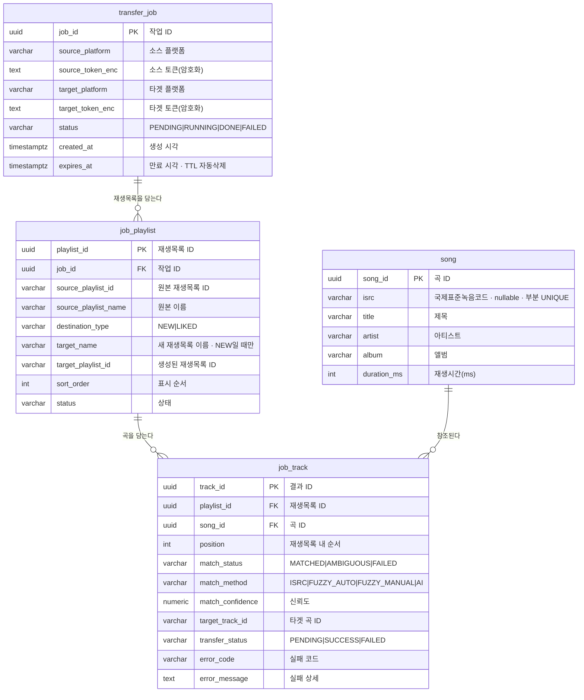

# ERD — 플레이리스트 이전 서비스

> v1.0 · 2026-09-21 · 짝 문서: [TRD.md](./TRD.md)
> 편집본: [ERDCloud](https://www.erdcloud.com/d/NPTsprjLe5fm2Wben)

P2(비동기 파이프라인)부터 사용하는 스키마. **P1에는 DB가 없다** — 토큰은 암호화 쿠키에,
선택 상태는 sessionStorage에 두고, DB는 워커가 생기는 시점에 들어온다.

---

## 다이어그램



## 인덱스 / 제약

```sql
CREATE INDEX ON job_playlist (job_id);
CREATE INDEX ON job_track (playlist_id, transfer_status);  -- 워커 재개: 안 끝난 곡만
CREATE INDEX ON transfer_job (expires_at);                 -- 만료 작업 정리

-- 같은 곡을 두 번 저장하지 않는다. ISRC가 없는 곡은 제약에서 빠진다(부분 유니크).
CREATE UNIQUE INDEX ON song (isrc) WHERE isrc IS NOT NULL;
```

곡 저장은 upsert로 한다:

```sql
INSERT INTO song (...) VALUES (...)
ON CONFLICT (isrc) DO NOTHING
RETURNING song_id;
```

## 삭제 규칙

| 관계 | 유형 | ON DELETE |
|---|---|---|
| `transfer_job` → `job_playlist` | 비식별 1:N | CASCADE |
| `job_playlist` → `job_track` | 비식별 1:N | CASCADE |
| `song` → `job_track` | 비식별 1:N | **RESTRICT** |

`song`만 RESTRICT인 이유: 곡은 여러 작업이 공유하므로 작업 하나를 지운다고 같이 지우면 안 된다.

---

## 보관 정책 — 개인정보는 사라지고, 공개 카탈로그만 남는다

| 테이블 | 성격 | 보관 |
|---|---|---|
| `transfer_job` | **토큰(개인정보)** | 2시간 후 TTL 삭제 |
| `job_playlist` | 누가 무엇을 옮겼는가 | 작업 삭제 시 CASCADE |
| `job_track` | 〃 | 〃 |
| `song` | **공개 카탈로그 정보** | **영구 보관 (캐시)** |

제목·아티스트·ISRC는 개인정보가 아니므로 지울 이유가 없고, 남겨야 캐시로 값을 한다.
`song → job_track`을 RESTRICT로 둔 이유가 이것.

---

## 설계 근거

### `job_playlist`를 둔 이유
TRD §2.2의 원래 스키마는 "플리 하나 옮기기" 전제였다. 지금은 한 작업에 **재생목록 여러 개**를
담고 목적지도 재생목록마다 다르므로(`NEW` / `LIKED`), 작업과 곡 사이에 계층이 하나 필요하다.

### 토큰을 DB에 두는 이유 — 선택이 아니다
P1은 암호화 쿠키만으로 충분하지만, P2에서 **워커는 HTTP 요청 맥락 밖에서 돌기 때문에 쿠키를
읽을 수 없다.** Spotify를 호출하려면 토큰이 DB에 있어야 한다. "비동기로 가면 세션 설계가
바뀐다"의 구체적인 사례.

### `error_code`를 `error_message`와 분리한 이유
실패를 **일시적**(429·타임아웃 → 재시도)과 **영구적**(곡 없음 → 재시도 안 함)으로 갈라야 하는데,
자유 텍스트로는 집계도 분기도 되지 않는다. TRD §5의 "실패 이분법"이 컬럼으로 드러난 것.

### `position`이 필요한 이유
UUID에는 순서가 없다. 매칭이 병렬로 끝나도 타겟에 쓸 때는 원래 순서대로 넣어야 제대로 된 이전이다.

### `isrc`가 nullable인 이유
ISRC가 없는 곡이 흔하고, 그것이 곧 `NO_SOURCE_ISRC` 실패 사유다. 필수로 두면 도메인을 왜곡한다.

### `song`을 분리한 이유 — 공간이 아니라 API 호출 절감
비정규화해서 `job_track`에 합치는 편이 단순하지만, 분리하면 같은 곡을 여러 작업이 공유한다.

이득은 저장 공간이 아니다(곡 한 행 ~200B, 10만 곡이어도 20MB). 진짜 값은
**`ISRC → target_track_id` 매핑을 재사용해 Spotify 검색 API를 건너뛰는 것**이다.
병목이 레이트리밋(앱 단위 30초 롤링)이므로 호출을 아끼는 것이 곧 속도다.
인기곡은 사용자 간에 겹치므로 적중률도 확보된다. 나중에 AI 판정 결과도 여기 쌓는다.

한계: ISRC가 없는 곡은 중복 제거가 안 된다. `(title, artist)`로 묶으려면 정규화가 필요하고
오판 위험이 있어 하지 않는다 — ISRC 없는 곡은 P1에서 어차피 매칭 실패라 캐시 가치도 없다.

> ⚠️ 타겟 플랫폼이 늘어나면 `ISRC → 트랙 ID`가 플랫폼마다 달라지므로,
> 그때는 `match_cache(song_id, target_platform, target_track_id)`가 따로 필요해진다.
> 타겟이 Spotify뿐인 동안은 `job_track.target_track_id`로 충분하다.

### 모든 관계가 비식별인 이유
모든 테이블이 UUID 대리키를 쓰므로 부모 키를 자식 PK에 얹을 이유가 없다. 식별 관계로 두면
`job_track`의 기본키가 컬럼 4개짜리 복합키가 되고, `job_id`가 `job_track`까지 전파된다.

---

## 정규화 수준과 근거

**3NF를 기준으로 두되, 두 곳은 의도적으로 지키지 않는다.**

### 1NF — 충족
모든 컬럼이 원자값이고 반복 그룹이 없다. 한 작업이 재생목록 여러 개를 담는다는 요구사항을
`transfer_job`에 배열 컬럼으로 넣지 않고 `job_playlist` 행으로 쪼갠 것이 이 조건의 실제 적용
지점이다. 곡 목록도 마찬가지로 `job_track` 행이다.

### 2NF — 충족 (자동으로)
부분 함수 종속은 **복합 기본키가 있어야** 성립한다. 모든 테이블의 PK가 단일 UUID 대리키이므로
"키의 일부에만 종속되는 컬럼"이라는 상황 자체가 만들어지지 않는다.
관계를 전부 비식별로 둔 결정(위 「모든 관계가 비식별인 이유」)의 부수 효과다.

### 3NF — 두 곳에서 의도적으로 위반

| 위치 | 비정규화된 값 | 정규화한다면 |
|---|---|---|
| `song.artist`, `song.album` | 아티스트명·앨범명을 문자열로 중복 저장 | `artist` / `album` 테이블 + FK |
| `job_playlist.source_playlist_name` | 원본 재생목록 이름을 복사 저장 | 원본 ID로 매번 조회 |

네 가지 이유로 지금 형태가 맞다.

**1. 외부 카탈로그의 스냅샷이지 마스터 데이터가 아니다.**
아티스트·앨범·제목의 진짜 원본은 Spotify의 카탈로그에 있고, 우리 `song` 테이블은 그것을 베껴 둔
캐시다. 마스터가 아닌 데이터를 정규화하면 "우리 쪽 `artist` 행과 Spotify의 아티스트 중 무엇이
맞는가"를 동기화하는 일이 새로 생긴다. 갱신 이상(update anomaly)을 막으려고 정규화하는 것인데,
애초에 우리가 갱신하지 않는 값이다.

**2. 아티스트 동일성 판정이 곧 이 프로젝트의 매칭 문제라 순환이 된다.**
`artist` 테이블을 두려면 "아이유"와 "IU"와 "IU (아이유)"가 같은 행인지 먼저 판정해야 한다.
그런데 그 판정이 바로 매칭 엔진이 풀려는 문제다. 스키마가 매칭 엔진의 출력을 요구하고
매칭 엔진은 스키마 위에서 돌아가는 순환이 생기고, 판정을 틀리면 오염이 카탈로그 전체에 남는다.
문자열로 두면 매칭은 실행 시점의 판단으로 격리되고, 틀려도 그 행 하나의 결과에 그친다.

**3. 아티스트와 앨범을 독립 개체로 다루지 않는다.**
"이 아티스트의 다른 곡", "앨범 단위 이전" 같은 기능이 없다. 이전 대상은 언제나 곡이고
(그래서 「좋아하는 앨범/아티스트」도 기각했다), 아티스트명·앨범명은 **매칭 점수를 계산하는
입력값**으로만 쓰인다. 조회하지 않는 개체를 테이블로 승격하면 JOIN만 늘고 얻는 것이 없다.

**4. 재생목록 이름은 시점 스냅샷이어야 한다.**
`source_playlist_name`은 "이전을 실행하던 시점에 그 재생목록의 이름이 무엇이었나"를 남기는
기록이다. 사용자가 나중에 원본 이름을 바꿔도 과거 작업 결과의 이름이 따라 바뀌면 안 되고,
애초에 작업이 끝난 뒤 원본을 조회할 토큰도 없다(2시간 TTL). 정규화해서 참조로 바꾸면
기록으로서 오히려 틀린 값이 된다.

### 대신 중복은 제약으로 막는다
3NF를 포기한 대가는 `song` 행이 중복될 수 있다는 것이고, 이는 ISRC 부분 유니크 인덱스가 막는다.

```sql
CREATE UNIQUE INDEX ON song (isrc) WHERE isrc IS NOT NULL;
```

ISRC가 있는 곡은 DB가 중복을 원천 차단하고(`ON CONFLICT (isrc) DO NOTHING`이 성립하는 근거),
ISRC가 없는 곡은 제약 밖에 남는다. `(title, artist)`로 묶지 않는 이유는 위의 **2번**과 같다 —
그 판정이 매칭 문제이므로 제약 조건으로 굳히면 안 된다.

---

## P1에 없고 P2에 생기는 것

| | P1 | P2 |
|---|---|---|
| 토큰 | 암호화 쿠키 (2시간) | `transfer_job`에 암호화 저장 |
| 선택 상태 | sessionStorage | `job_playlist` / `job_track` |
| 진행률 | 없음 (동기) | `job_track.transfer_status` 집계 |
| 재개 | 불가 | `(playlist_id, transfer_status)` 인덱스로 미완료 조회 |
